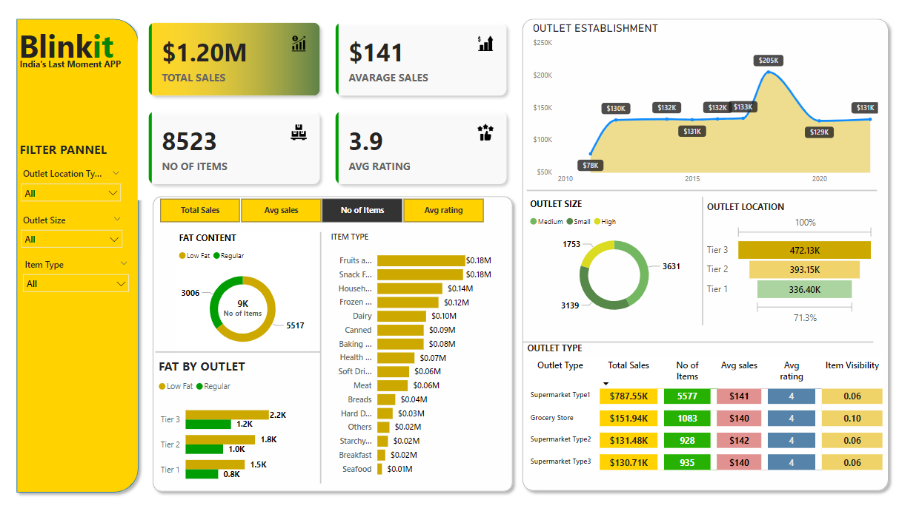

# 📊 Blinkit Sales Dashboard (Practice Project)

## 📌 Project Overview

This Power BI dashboard provides insights into Blinkit's sales data, analyzing key metrics such as total sales, number of items sold, ratings, outlet establishment trends, outlet size, and location-based sales distribution.

## 📈 Key Features

- **Total Sales & Average Sales** – Displays revenue insights.
- **Number of Items Sold** – Shows the total number of items sold.
- **Average Rating** – Represents customer ratings for different products.
- **Outlet Establishment Trends** – Tracks the establishment growth over time.
- **Fat Content Analysis** – Breaks down products based on fat content (Low Fat vs. Regular).
- **Outlet Size & Type Analysis** – Analyzes outlet distribution by size and type.
- **Location-based Sales Analysis** – Compares sales across Tier 1, Tier 2, and Tier 3 cities.

## 🛠️ Tools & Technologies Used

- **Power BI** – Used for data visualization and dashboard creation.

## 📥 Dataset

[Download Dataset](https://drive.google.com/drive/folders/1mKh61zKVBnPJN0A5lc77osGNkmNa-loI)
